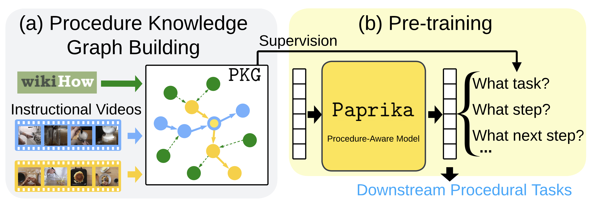
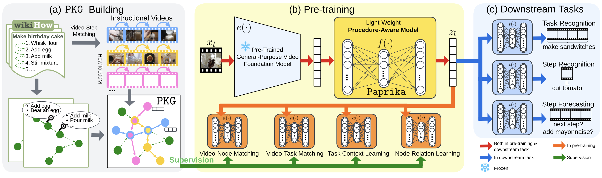

This is an official implementation of *Procedure-Aware Pretraining for Instructional Video Understanding*. In this repository, we provide PyTorch code for pre-processing, training and evaluation as described in the paper. 

The proposed model **Paprika** was trained from **P**rocedure-**A**ware **PR**e-training for **I**nstructional **K**nowledge **A**cquisition. We evaluate Paprika on COIN and CrossTask for downstream procedure understanding tasks such as task recognition, step recognition, and step forecasting. Paprika yields a video representation that improves over the state of the art: up to 11.23% gains in accuracy in 12 evaluation settings.

If you find our repo useful in your research, please use the following BibTeX entry for citation.

```BibTeX
@article{zhou2023paprika,
  title={Procedure-Aware Pretraining for Instructional Video Understanding},
  author={Zhou, Honglu and Martin-Martin, Roberto and Kapadia, Mubbasir and Savarese, Silvio and Niebles, Juan Carlos},
  journal={Proceedings of the IEEE/CVF Conference on Computer Vision and Pattern Recognition},
  year={2023}
}
```
<p align="left">
    
</p>


# Installation
Please run the following commands in your shell:
```shell
conda create -n paprika python=3.8
conda activate paprika
pip install -r requirements.txt
```

# Dataset Preparation
## wikiHow
[wikiHow](https://github.com/mahnazkoupaee/WikiHow-Dataset) is a text-based procedural knowledge database. The version of the wikiHow dataset that we used for both of the Procedural Knowledge Graph construction and model pre-training has a total of 10, 588 step headlines from 1, 053 task articles. These wikiHow tasks have at least 100 video samples in the HowTo100M dataset. Please follow the [instructions provided here](https://github.com/facebookresearch/video-distant-supervision) to obtain the data (i.e., [step_label_text.json](https://github.com/facebookresearch/video-distant-supervision/blob/main/data_and_csv.zip)).    

The wikiHow dataset stored in `step_label_text.json` is a list with a length of 1053, i.e., 1053 sublists representing 1053 task articles. The length of each sublist corresponds to the number of steps of that task article; each element in the sublist is a dictionary with detailed step information. Note that we only used the step 'headline'.

## HowTo100M
[HowTo100M](https://www.di.ens.fr/willow/research/howto100m/) is a large-scale unlabeled instructional video corpus. Please follow instructions from [dataset provider](https://www.di.ens.fr/willow/research/howto100m/) to download videos, metadata, and subtitles if needed.

Particularly, for pretraining on the subset of HowTo100M with 85K videos that we mentioned in our paper, we used [train.csv](https://github.com/facebookresearch/TimeSformer#howto100m-dataset-split)  provided by authors of TimeSformer to obtain the list of video IDs.

## COIN
The [COIN](https://coin-dataset.github.io/) dataset is one of the datasets that we used for downstream tasks. COIN contains 11K instructional videos covering 778 individual steps from 180 tasks in various domains. The average number of steps per video is 3.9.

Please follow the [instructions](https://coin-dataset.github.io/) provided by the authors of the COIN dataset to download the raw videos from YouTube, and their annotations in JSON format.   

After downloading the dataset, please populate the `coin_video_dir` and `coin_annoataion_json` fields in the config files of the downstream evaluation settings accordingly when you need to start a downstream evaluation setting (described below).    

## CrossTask
The [CrossTask](https://github.com/DmZhukov/CrossTask) dataset is the other dataset that we used for downstream tasks. CrossTask has 4.7K instructional videos annotated with task name for each video spanning 83 tasks with 105 unique steps. 2.7K videos have steps' class and temporal boundary annotations; these videos are used for the Step Recognition and Step Forecasting tasks. 8 steps per video on average.

Please follow the [instructions](https://github.com/DmZhukov/CrossTask#crosstask-dataset) provided by the authors of the CrossTask dataset to download the raw videos from YouTube, and their annotations.

After downloading the dataset, please populate the `cross_task_video_dir` and `cross_task_annoataion_dir` fields in the config files of the downstream evaluation settings accordingly when you need to start a downstream evaluation setting (described below).    


# Feature Extraction
We used a practical framework that trains a light-weight procedure-aware model (i.e., Paprika) that refines the video segment feature extracted from a frozen general-purpose video foundation model. The  frozen general-purpose video foundation model we used is the S3D Text-Video model trained from scratch on HowTo100M using MIL-NCE. 

To obtain the frozen S3D model: https://github.com/antoine77340/S3D_HowTo100M#getting-the-data

We used this frozen S3D model to (1) extract visual features of video segments in HowTo100M, COIN and CrossTask using the video branch of S3D; and (2) extract text features of step headlines in wikiHow using the text branch of S3D. To perform the feature extraction using the frozen S3D model, please refer to the following repositories:
* https://github.com/antoine77340/S3D_HowTo100M
* https://github.com/antoine77340/MIL-NCE_HowTo100M

In addition, [MPNet](https://huggingface.co/sentence-transformers/all-mpnet-base-v2) was also used to extract text features of step headlines in wikiHow. Please refer to https://huggingface.co/sentence-transformers/all-mpnet-base-v2#usage-sentence-transformers.

Video segments are set to be 9.6 seconds long. There is no temporal overlapping or spacing between segments of one video. 

For flexible usage and ease of reproducibity, we provide the extracted text features of step headlines in wikiHow, and the extracted visual featurs of video segments for a sample HowTo100M dataset containing 6 videos. Please use [this link](https://drive.google.com/file/d/1bciJyNK28D2sEGhSyOTHk527e7jLcQyL/view?usp=share_link) to download the extracted features in order to run the following pre-processing code.

# Reproducibility
In the following, we describe how to pre-train and evaluate Paprika.   

The entire pipeline contains 3 stages: (1) pre-processing, (2) pre-training and (3) downstream evaluation.   

<p align="left">
    
</p>

## Pre-processing
The pre-processing stage must be completed before running the model pre-training. The pre-processing stage mainly extracts the pseudo labels for each video segment in the pre-training video corpus beforehand. The pre-processing stage does not require GPUs.   

The pseudo labels that Paprika requires are generated from an automatically constructed Procedural Knowledge Graph (PKG). The PKG is automatically built by combining information from wikiHow and HowTo100M.

If you hope to try with the pre-processing code using our provided HowTo100M sample dataset containing only 6 videos, please first modify and verify paths in `configs/PKG_sampledata_pseudo_labels.yml` and then run the following command in your shell:   

```shell
python engines/main_PKG_pseudo_labels.py --cfg configs/PKG_sampledata_pseudo_labels.yml
```

To perform the pre-processing for the HowTo100M subset with 85K videos that we have used in our paper for pre-training Paprika, please change the config file into `configs/PKG_pseudo_labels.yml` in the above command. Modify the config correspondingly for the full HowTo100M data.

After the pre-processing code is completed: 
* `video_IDs.npy`, a folder named `pseudo_labels`, a folder named `samples` and a folder named `sim_scores` will be generated and saved inside the directory of `howto100m_dir`. 
* The mapping between node ID and step ID (i.e., `node2step.pickle` and `step2node.pickle` will be generated and saved inside the directory of `wikihow_dir`.  

**NOTE!!!** To prevent files from being overwritten (especially when dealing with large datasets such as the HowTo100M subset), please pay attention to the paths in the config file.     

#### **Regarding the pre-processing config file:**        
`PKG_sampledata_pseudo_labels.yml` and `PKG_pseudo_labels.yml`  are the pre-processing config files for the HowTo100M sample dataset and the HowTo100M subset respectively. 

The current configurations in the files are the ones we used in the paper. Please verify and modify if needed the following configurations in the config file:
- wikihow_dir: it should be the directory where you stored the wikiHow dataset. It is assumed that the `step_label_text.json` is stored in this directory.   
- wikihow_num_tasks: the number of unique wikiHow task names covered by the downloaded wikiHow dataset.   
- howto100m_dir: it should be the parent directory of the `feats` folder that stored the extracted video segment features (i.e., the `feats` folder is inside `howto100m_dir`)
- howto100m_num_tasks: the number of unique HowTo100M task names covered by the downloaded HowTo100M dataset. Please change accordingly if the version of HowTo100M dataset you have has a different number of tasks (e.g., due to unavailable videos).    
- video_meta_csv_path: it should be the path to the downloaded `HowTo100M_v1.csv`. `HowTo100M_v1.csv` is released by the authors of the HowTo100M dataset and this file is required by the Video-Task Matching pre-training objective. You can download this file by typing `wget https://www.rocq.inria.fr/cluster-willow/amiech/howto100m/HowTo100M.zip` in your shell.    
- task_id_to_task_name_csv_path: it should be the path to the downloaded. `task_ids.csv`. `task_ids.csv` is released by the authors of the HowTo100M dataset and this file is required by the Video-Task Matching pre-training objective. You can download this file by typing `wget https://www.rocq.inria.fr/cluster-willow/amiech/howto100m/HowTo100M.zip` in your shell.   
- num_workers: the number of worker processes for multi-processing.   
- num_partitions: it should be the number of GPUs you will later use for model pre-training. Dataset partitioning is set for large datasets such as the HowTo100M subset or fullset, but it is not set for the HowTo100M sample dataset in the current config file since it only has 6 videos.   
- log_dir and checkpoint_dir: the directory to save the outputs (e.g., logs). Pre-processing code will not save anything to checkpoint_dir.

## Pretraining
We used 8 NVIDIA A100 GPUs for Paprika pre-training on the HowTo100M subset. The following shell command was the one we used to start the Paprika pre-training:

```shell
CUDA_VISIBLE_DEVICES=0,1,2,3,4,5,6,7 python -m torch.distributed.launch --nnodes=1 --nproc_per_node=8 engines/main_Paprika_pretrain.py --cfg configs/Paprika_pretrain.yml --use_ddp 1 --use_wandb 0
```

The following is the command to use if you hope to use only 1 GPU:

```shell
CUDA_VISIBLE_DEVICES=0 python engines/main_Paprika_pretrain.py --cfg configs/Paprika_pretrain.yml --use_wandb 0
```

#### **Regarding the pre-training config file (i.e., configs/Paprika_pretrain.yml):**       
The current configurations in the `configs/Paprika_pretrain.yml` file are the ones we used in the paper that obtained the best overall result, which means that the Paprika model will be pre-trained using the **Video-Node Matching** (VNM), **Video-Task Matching** (VTM wikiHow + HowTo100M), **Task Context Learning** (TCL wikiHow) and **Node Relation Learning** (NRL 2 hops).    
Please verify and modify if needed the following configurations in the config file:   
- project: if wandb will be used, please input your wandb project name here.    
- entity: if wandb will be used, please input your wandb entity name here.    
- wikihow_dir: it should be the directory where you stored the wikiHow dataset. It is assumed that the `step_label_text.json` is stored in this directory.  
- wikihow_num_tasks: the number of unique wikiHow task names covered by the downloaded wikiHow dataset.   
- howto100m_dir: it should be the parent directory of the `feats` folder that stored the extracted video segment features (i.e., the `feats` folder is inside `howto100m_dir`)  
- howto100m_num_tasks: the number of unique HowTo100M task names covered by the downloaded HowTo100M dataset. Please change accordingly if the version of HowTo100M dataset you have has a different number of tasks (e.g., due to unavailable videos).    
- checkpoint_dir: the directory to save the model checkpoints.    
- log_dir: the directory to save the pre-training log.     

## Downstream Evaluation
Our downstream evaluation involves 2 downstream datasets (COIN and CrossTask), 3 downstream tasks (SF: Step Forecasting, SR: Step Recognition, and TR: Task Recognition), and 2 types of downstream models (MLP or Transformer). In total, there are 2x3x2 = 12 evaluation settings. The config file for each of the evaluation setting is availbe in the subfolder `configs/downstream/`. 

The shell commands across the 12 evaluation settings only differ in the config file name. For example, the following shell command is the one to use to start the downstream model training and testing on the evaluation setting of MLP x COIN x SF (i.e., use a MLP downstream task model; downstream dataset is the COIN dataset; and the downstream task is Step Forecasting):   

```shell
CUDA_VISIBLE_DEVICES=0 python engines/main_train_taskhead.py --cfg configs/downstream/mlp_coin_sf.yml --checkpoint /export/share/hongluzhou/data/checkpoints/Paprika_howto100m_fullset.pth
```

Please use the correct path to the pre-trained Paprika model in the above command.  
         
#### **Regarding the downstream evaluation config file (e.g., configs/downstream/mlp_coin_sf.yml):**       
Please verify and modify if needed the following configurations in the config file:   
- project: if wandb will be used, please input your wandb project name here.    
- entity: if wandb will be used, please input your wandb entity name here.    
- cross_task_video_dir: it should be the directory where you stored the videos of the CrossTask dataset.   
- cross_task_s3d_feat_dir: it should be the directory where you stored the extracted features of the CrossTask dataset.   
- cross_task_annoataion_dir: it should be the directory where you stored the [annotation](https://github.com/DmZhukov/CrossTask#crosstask-dataset) folder provided by the CrossTask authors.
- coin_video_dir: it should be the directory where you stored the videos of the COIN dataset.   
- coin_annoataion_json: it should be the path to the downloaded `COIN.json`. The file `COIN.json` is released by the COIN authors.   
- coin_s3d_feat_dir: it should be the directory where you stored the extracted features of the COIN dataset.   
- checkpoint_dir: the directory to save the downstream model checkpoints.    
- log_dir: the directory to save the downstream evaluation log.     

# Acknowledgements
We thank the authors of the following repositories/sources for releasing their data or implementations:
* https://github.com/antoine77340/S3D_HowTo100M
* https://github.com/antoine77340/MIL-NCE_HowTo100M
* https://github.com/facebookresearch/video-distant-supervision
* https://github.com/facebookresearch/TimeSformer
* https://huggingface.co/sentence-transformers/all-mpnet-base-v2
